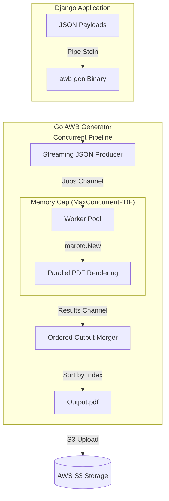

# GoWay: Optimized AWB Generation Architecture

`GoWay` is a high-performance, memory-efficient PDF generation engine designed to handle large-scale Air Waybill (AWB) batches while maintaining a minimal memory footprint.

## 📐 System Architecture

The core of the system is a **Single-Producer, Multi-Worker, Single-Consumer (SPSC)** lock-free pipeline.

## 🚀 Key Technical Features

### 1. Streaming JSON Decoding
Unlike traditional JSON parsers, `GoWay` uses a `json.Decoder` to stream objects from `stdin` or disk. It never loads the entire payload into memory, allowing it to process 10,000+ labels without crashing.

### 2. Concurrency Control (Semaphores)
To prevent the Go runtime from spawning hundreds of memory-hungry PDF renderers (Maroto instances) on high-core-count machines, we use a **counting semaphore** (`MaxConcurrentPDF`). This bounds peak heap usage to a predictable constant, regardless of incoming load.

### 3. Pre-allocated Buffers
We pre-allocate a **5 KB buffer** for every label based on production profiling. This eliminates the "Slice-Doubling" overhead (`bytes.growSlice`) which accounted for 79% of memory allocations in the previous version.

### 4. Direct-to-Disk Merging
The final merger (`pdfcpu`) writes directly to the disk in chunks. The system never buffers the final multi-megabyte PDF in RAM, keeping the resident set size (RSS) stable.

## 🛠 Integration
The Django dashboard communicates with `awb-gen` via a **Subprocess Bridge**. 
1. Django converts objects to JSON.
2. Pipes the JSON to `awb-gen`'s `stdin`.
3. Reads the finished `.pdf` from disk and uploads to S3.
