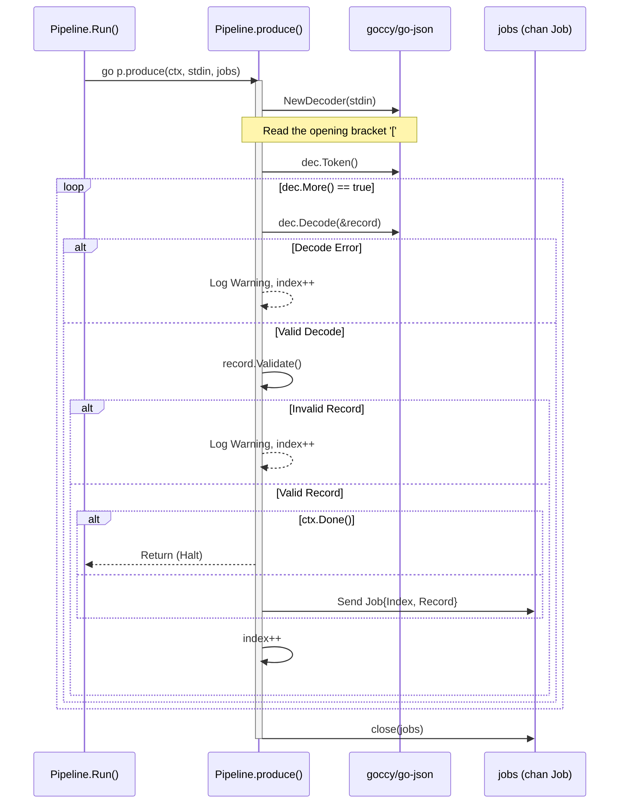
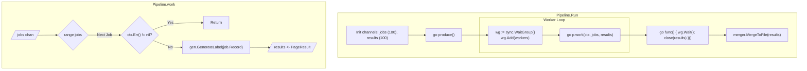
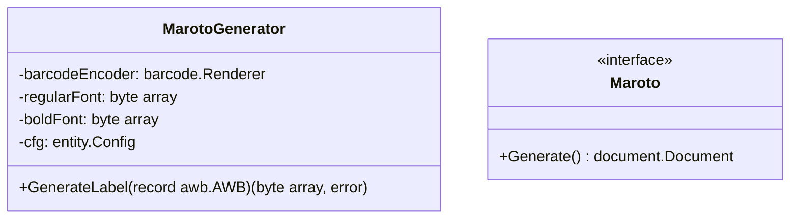
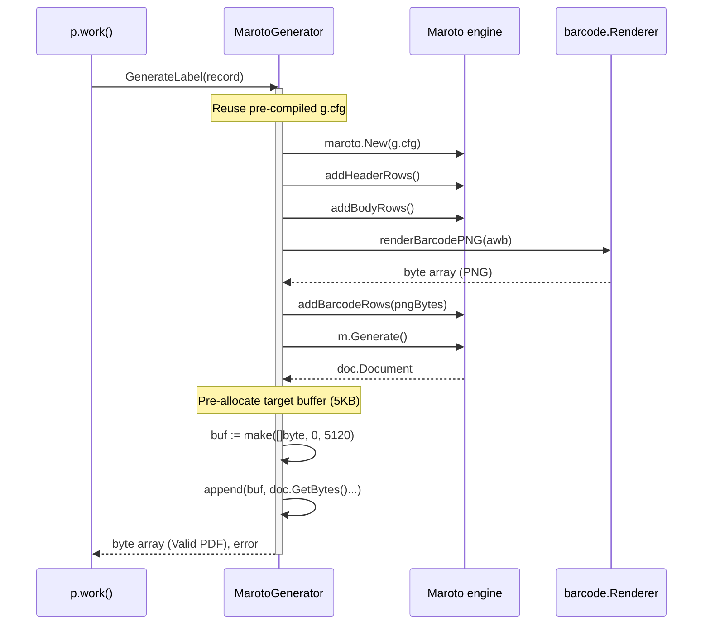
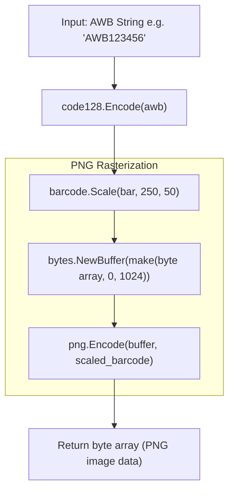
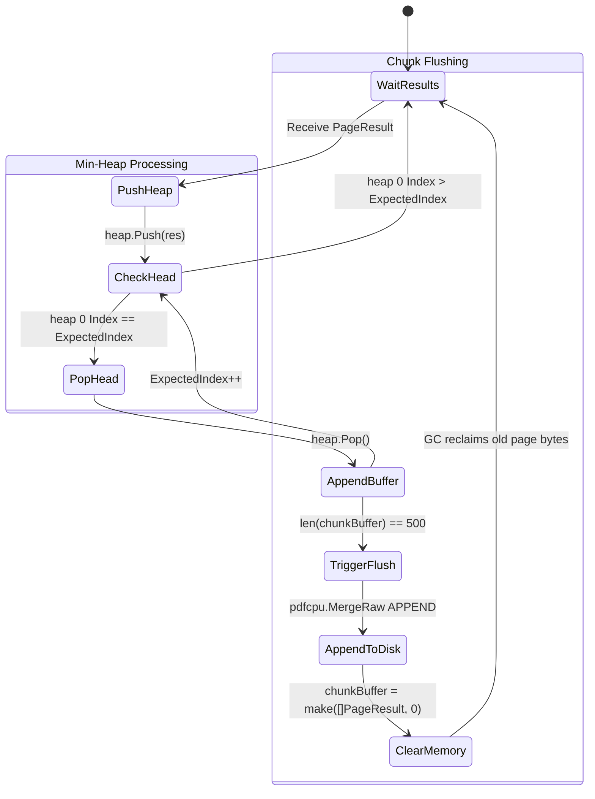
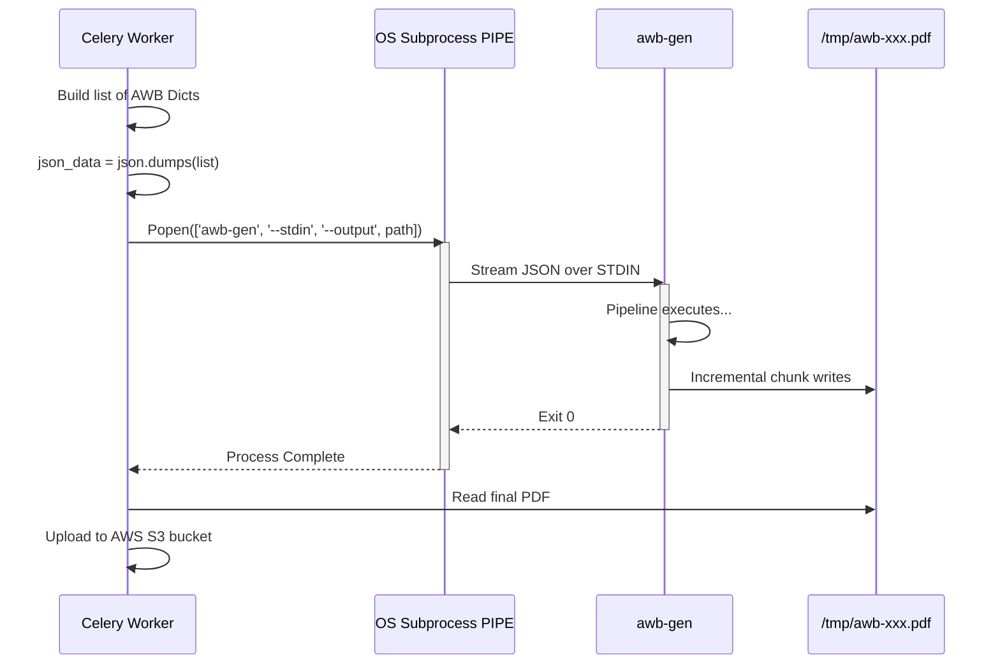

# GoWay: Deep Dive Architecture & Mechanics

This document provides a **painfully detailed, code-level breakdown** of the 6 major components that power the `awb-gen` high-performance PDF pipeline. 

Each component corresponds to a specific stage in the Single-Producer, Multi-Worker, Single-Consumer (SPSC) architecture.

---

## 1. The Ingestion Engine (The Producer)
**Location:** `internal/pipeline/produce_method.go`  
**Purpose:** Safely ingest a theoretically infinite stream of JSON objects without ever loading the entire array into RAM.

---

## 2. The Concurrency Orchestrator (Worker Pool)
**Location:** `internal/pipeline/run_method.go` & `work_method.go`  
**Purpose:** Manage exactly N worker goroutines (usually bound to physical CPU cores) to process the `jobs` channel concurrently. It explicitly handles graceful shutdown and channel closing.

---

## 3. The Label Generator (Rendering Engine)
**Location:** `internal/generator/generate_method.go` & `maroto_ctor.go`  
**Purpose:** Converts a single `AWB` struct into a standalone PDF byte slice. Following our latest optimizations, the configuration (`*entity.Config`) is cached, entirely eliminating font overhead per-label.

---

## 4. The Barcode Engine
**Location:** `internal/barcode/render_method.go`  
**Purpose:** Converts alphanumeric AWB strings into highly readable Code128 PNG bitmaps that `maroto` can embed.

---

## 5. The Windowed Merger (The O(1) Optimization)
**Location:** `internal/merger/merge_method.go`  
**Purpose:** This is the heart of the system's memory stability. Because Worker 8 might finish Job 12 before Worker 1 finishes Job 11, the results arrive **out of order**. The merger buffers them in a Min-Heap and flushes them.

---

## 6. The Integration Bridge (Django & CLI)
**Location:** `cmd/root.go` & `reverse_awb_generation.py`  
**Purpose:** How Python communicates with the compiled Go binary. Python uses `subprocess` to stream JSON.

