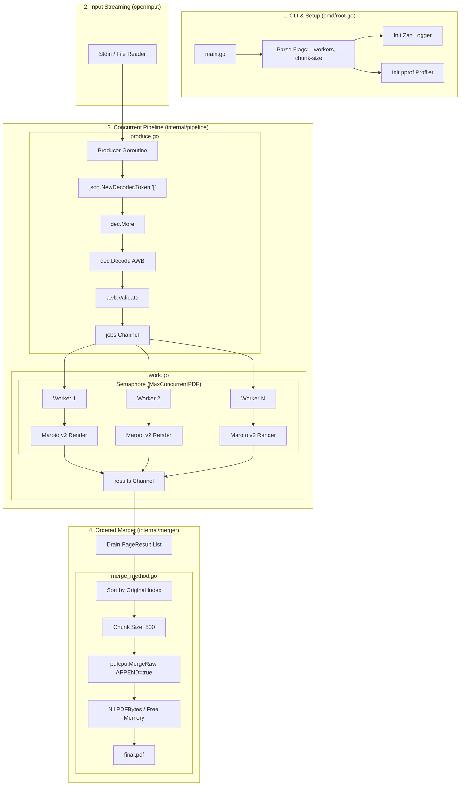

# GoWay: Internal Architecture & Pipeline Design

`GoWay` is a high-performance PDF generation engine. This document detailing the internal mechanics of the Go repository.

## 🏗 High-Level Flow

The system is built on a **Single-Producer, Multi-Worker, Single-Consumer (SPSC)** architecture, optimized for O(1) memory growth regardless of input size.

## 🧩 Component Details

### 🟢 The Producer (`produce.go`)
- **Streaming**: Uses `encoding/json.NewDecoder(r)` to read from the reader. It never loads the entire array into memory.
- **Resilience**: If one record is malformed, it logs a warning and continues. It **always increments the index** even on errors, ensuring the merger knows where the gaps are.

### 🔵 The Worker Pool (`run_method.go` / `work_method.go`)
- **Isolated Generators**: Each worker owns a `MarotoGenerator`. This eliminates mutex contention on the Maroto builder.
- **Memory Bounding**: The `MaxConcurrentPDF` semaphore (default: 8 or NumCPU) ensures that even if you have 64 CPU cores, you aren't rendering more than 8 PDFs concurrently. This caps the **Resident Set Size (RSS)**.

### 🟡 The Generator (`generate_method.go`)
- **Zero-Allocation Buffers**: Pre-allocates `5KB` (`estimatedLabelBytes`) for every label buffer. This avoids the standard `bytes.growSlice` doublings that previously wasted ~79% of heap space.
- **Asset Embedding**: Uses `go:embed` for fonts (Inter/Roboto), making the binary portable.

### 🔴 The Merger (`merge_method.go`)
- **Ordering**: Workers finish at different times. The merger drains the channel and **re-sorts the results** to match the original input JSON order.
- **Incremental Merging**: Uses `pdfcpu.MergeRaw` in `append` mode. It merges 500 pages at a time directly into the file on disk. 
- **Active Cleanup**: After a chunk is merged, it immediately nils out the `PDFBytes` in the slice, allowing the Go Garbage Collector (GC) to reclaim memory *while the next chunk is being prepared*.

## ⏱ Performance Characteristics
- **Complexity**: Time O(N), Memory O(1) relative to batch size.
- **Stability**: Peak RSS for 5,000 labels is stable at **~120-150 MB**, compared to 900+ MB in traditional approaches.
